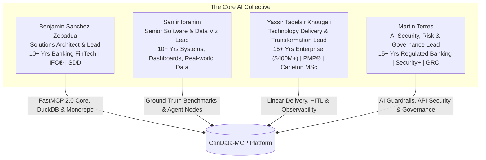

# Canadian Open Data Agentic Platform (CanData-MCP & LangGraph Suite)
## Master Collaboration Blueprint, Team Roles, Daily Workflow & Launch Roadmap (2026 Edition)

**Official Repository:** [https://github.com/neobenjax/Canadian-Open-Data-Agentic-Platform.git](https://github.com/neobenjax/Canadian-Open-Data-Agentic-Platform.git)  
**Task Management:** [Linear Workspace CanData Platform (Team Key: `CAN`)](https://linear.app/canopendataagenticplatform/team/CAN/active)  
**Linear Join Link:** [https://linear.app/canopendataagenticplatform/join/086e02cf75e8b0f113d0214368e4342a?s=0](https://linear.app/canopendataagenticplatform/join/086e02cf75e8b0f113d0214368e4342a?s=0)

---

## 1. Executive Summary & Vision

### 1.1 What Are We Building?
We are building **CanData-MCP**: a high-speed, open-source AI bridge and multi-agent system connecting autonomous LLM agents (Claude, Cursor, custom agents) directly to official Canadian public APIs (**Statistics Canada Web Data Service**, **Bank of Canada Valet API**, and **Open Government Canada CKAN API**).

It solves the **"Truth & Token Economics"** gap in Canadian public data:
- **Zero Hallucination:** Models stop guessing on Canadian municipal housing and inflation numbers by enforcing verified table citations.
- **Token Compression:** Slices massive 200MB CSV cubes down to clean `<3KB` summaries in under 1.5 seconds using in-memory **DuckDB 1.2+** with Apache Arrow zero-copy memory buffers.
- **Deterministic Math:** Executes exact SQL aggregations instead of unreliable LLM mental math.
- **Multi-Agent Synthesis:** A **LangGraph 0.2+** multi-agent graph coordinates specialized sub-agents (extractor, analyst, citation verifier) with durable state checkpointing (`AsyncSqliteSaver`).

### 1.2 Why Are We Doing This Together?
1. **Proof of Work Beats 500 Resumes:** In the 2026 Canadian tech job market, blind resume applications get filtered by automated ATS screeners. By building a production-grade open-source platform, we produce verifiable receipts (code, benchmarks, live demos) that attract tech leads and recruiters directly.
2. **The 4-Person Enterprise Advantage:** Combining 50+ years of collective experience across banking architecture, data visualization, large-scale enterprise transformation, and information security produces software that looks, feels, and operates like enterprise software.
3. **Sustainable Pace:** Each team member commits **2 to 4 hours per week**. Working as an aligned collective ensures rapid weekly delivery without burnout.

---

## 2. Meet the Collective: 4 Pillars & Real Backgrounds



### 1. Benjamin Sanchez Zebadua
**Role:** Project Lead & Solutions Architect (Episode 1 Lead)  
🔗 **LinkedIn:** [benjaminsanchezzebadua](https://www.linkedin.com/in/benjaminsanchezzebadua/)
- **Background:** Frontend Infrastructure Engineer & Solutions Architect with 10+ years scaling high-volume banking technology and FinTech platforms. Expert in monorepo architectures, developer enablement pipelines, scalable design systems, and high-traffic web performance. Led multi-scrum teams through infrastructure overhauls safeguarding digital banking for 2M+ active users.
- **Domain Credentials:** Postgraduate Diploma in Financial Planning & Wealth Management; IFC® Certified (Investment Funds in Canada); Spec-Driven Development (SDD).
- **AI Upskilling Focus:** FastMCP 2.0 protocol core, DuckDB 1.2+ Apache Arrow vectorized query engine, LangGraph state graph architecture, PyPI packaging, and monorepo governance.

### 2. Samir Ibrahim
**Role:** Co-Lead, Data Visualization & Agent Evaluation Lead (Episode 2 Lead)  
🔗 **LinkedIn:** [samiroibrahim](https://www.linkedin.com/in/samiroibrahim/)
- **Background:** Senior Software Engineer at Bitcoin Innovation Hub with over a decade of experience designing and developing software solutions focused on real-world applications, data visualization, interactive dashboards, and analytics across healthcare, education, HR, and finance.
- **Domain Credentials:** Creator of the GTA Housing benchmark dataset (CMHC rent + StatCan income across 25 municipalities), establishing verified ground-truth data.
- **AI Upskilling Focus:** LangGraph multi-agent reasoning nodes, prompt engineering with deterministic output schemas, DeepEval / NIST Inspect AI CI evaluation suites, and dynamic Plotly economic trend visualizers.

### 3. Yassir Tagelsir Khougali
**Role:** Technology Delivery, PMO & Human-in-the-Loop Transformation Lead (Episode 3 Lead)  
🔗 **LinkedIn:** [yassir-tagelsir-khougali](https://www.linkedin.com/in/yassir-tagelsir-khougali/)
- **Background:** Technology transformation leader with 15+ years of international experience delivering large-scale enterprise modernization programs across digital infrastructure, enterprise systems, cloud modernization, business automation, and systems integration exceeding $400M and impacting 12M+ users.
- **Domain Credentials:** PMP® Certified; Carleton University Master's in Applied Business Analytics candidate (Technology Innovation Management).
- **AI Upskilling Focus:** LangGraph Human-in-the-Loop (`interrupt()`) workflow design, OpenTelemetry / Arize Phoenix observability and token cost telemetry, stakeholder user testing scripts, and Linear.app agile delivery management.

### 4. Martin Torres
**Role:** AI Security, Risk & Governance (GRC) Lead (Episode 4 Lead)  
🔗 **LinkedIn:** [martin-torres-cybersecurity](https://www.linkedin.com/in/martin-torres-cybersecurity/)
- **Background:** Technology and Operational Risk professional with 15+ years in regulated banking environments specializing in technology operations, internal controls, application security, incident remediation, and business continuity. Completed the Information Security Analyst Program (Correlation One).
- **Domain Credentials:** CompTIA Security+ Certified; Banking Technology Risk, Governance, Risk and Compliance (GRC), and Information Security.
- **AI Upskilling Focus:** AI Guardrails, Pydantic v2 schema-enforced validation, public API security, Canadian data lineage tracking, prompt injection defenses, Docker container hardening, and DevSecOps in CI/CD.

---

## 3. The Big Picture: Rotating Leadership Across Projects

### 3.1 Project #1 is Just the Beginning
This platform represents **Project #1 (led by Benjamin)**. 

Our team vision is to keep this collective intact across future collaborative initiatives where **other team members will step up as Project Leads**:
- Samir can lead a future project focused on real-world decision intelligence and advanced visual analytics.
- Yassir can lead a future project focused on enterprise AI workflow transformation and operational governance.
- Martin can lead a future project focused on banking-grade AI security, automated guardrails, and compliance.

**The Win-Win Result:** Every single member gains **both** full-stack technical commits across modern AI tools AND a **verified Team Lead credential** on their resume and LinkedIn profile.

### 3.2 Collective Rotation Over Siloed Boundaries
We reject corporate silos where one person only codes backend and others only write documents. **Everyone writes Python code, configures AI tools, builds evaluation tests, and opens GitHub Pull Requests**, ensuring everyone can confidently whiteboard the architecture during technical interviews.

---

## 4. The Daily Developer Workflow & Linear Integration

### 4.1 Git Flow with Branch Protection
GitHub blocks direct pushes to `main`. Every contribution follows this standard lifecycle:
1. **Pull latest `main`:** `git checkout main && git pull origin main`
2. **Create feature branch:** `git checkout -b feat/CAN-XXX-description` *(where `CAN-XXX` is your Linear issue key)*
3. **Write code with AI assistant:** Use Cursor, Claude Code, or Antigravity configured with `AGENTS.md`.
4. **Run pre-flight checks:** `uv run ruff check .` and `uv run pytest`
5. **Commit with Linear key:** `git commit -m "[CAN-XXX] feat: description"`
6. **Push and open PR:** Push branch and open PR with `Closes CAN-XXX`.
7. **Peer Review:** 1 teammate approves the PR $\rightarrow$ Merge to `main` $\rightarrow$ Purge branch.

### 4.2 The 2-Minute Daily WhatsApp Routine
Post a brief 3-line update in our WhatsApp group before **10:00 AM EST**:
```markdown
**[Name] Daily Sync**
✅ **Done Yesterday:** [Linear Task CAN-XXX / PR #]
➡️ **Today's Focus:** [Next Linear Task]
🚧 **Blockers:** [None / specific blocker]
```
**"Never Silently Blocked" Rule:** If you are blocked for $>2$ hours or your day job gets busy, flag it early in the chat. A teammate will jump in to pair-program without judgment.

---

## 5. Clean Monorepo Architecture

```
canadian-open-data-agentic-platform/
├── packages/                               # TIER 1: PUBLIC REUSABLE PACKAGES
│   ├── candata-mcp/                        # FastMCP 2.0 Server (PyPI: candata-mcp)
│   └── agent-orchestrator/                 # LangGraph 0.2+ Multi-Agent Engine
├── apps/                                   # TIER 2: PUBLIC USER INTERFACES
│   ├── docs-portal/                        # Next.js 15 App Router Documentation Site
│   └── portfolio-site/                     # Results-first Landing Page (Custom Active Theme)
├── collaboration/                          # TIER 3: INTERNAL TEAM WORKSPACE
│   ├── meetings/                           # Sprint notes and retrospectives
│   ├── benchmarks/                         # Ground-truth questions and eval logs
│   ├── governance/                         # Security checklists and API risk registers
│   └── ABOUT_THE_TEAM.md                   # Team profiles and LinkedIn links
├── .github/                                # ENTERPRISE CI/CD & TEMPLATES
│   └── PULL_REQUEST_TEMPLATE.md            # Linear link, test proofs, and GRC checklist
├── CONTRIBUTING.md                         # Branch protection and ruleset guidelines
├── AGENTS.md                               # Universal agent guardrails & role selector
└── presentation/                           # KICKOFF PRESENTATION
    └── index.html                          # 16:9 interactive HTML slide deck
```

---

## 6. Revised Project Roadmap (Starting Sprint 0 Trial Week)

```
Sprint 0 (Oct 7 - Oct 14)  : Milestone 0 — Team Onboarding & Gitflow Trial Week
Sprint 1 (Oct 14 - Oct 21) : Milestone 1 — FastMCP 2.0 Core & Ground-Truth Benchmarks
Sprint 2 (Oct 21 - Oct 28) : Milestone 2 — LangGraph Multi-Agent Orchestration & Observability
Sprint 3 (Oct 28 - Nov 4)  : Milestone 3 — Documentation Portal, Streamlit UI & HITL
Sprint 4 (Nov 4 - Nov 11)  : Milestone 4 — Automated CI/CD Evals & AI Security Guardrails
Sprint 5 (Nov 11 - Nov 18) : Milestone 5 — PyPI Packaging, Cloud Hosting & Public Beta
Sprint 6 (Nov 18 - Nov 25) : Milestone 6 — Portfolio Showcase & Career Blitz
```

---

## 7. Recommended Core Skills & Standards

All team members are encouraged to install these three core skill repositories into their AI agents:
1. **Frontend Slides Skill:** [https://github.com/zarazhangrui/frontend-slides](https://github.com/zarazhangrui/frontend-slides) — for weekly progression demo decks.
2. **Modern Web Guidance (Google Chrome Team):** [https://github.com/googlechrome/modern-web-guidance](https://github.com/googlechrome/modern-web-guidance) — for accessible, clean frontend web patterns.
3. **Python Best Practices (Ludo Technologies):** [https://github.com/ludo-technologies/python-best-practices](https://github.com/ludo-technologies/python-best-practices) — for modern, typed Python 3.12+ engineering.
