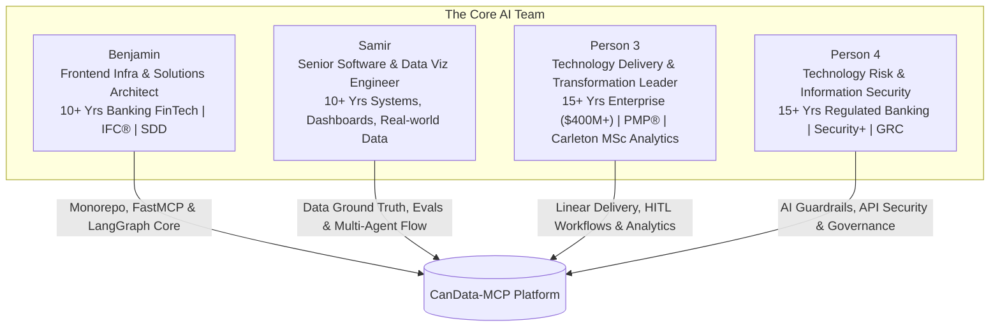

# Canadian Open Data Agentic Platform (CanData-MCP & LangGraph Suite)
## Master Strategic Blueprint, Team Roles, AI Assistant Personas & Accelerated 6-Week Launch Plan (2026 Edition)

**Official Repository:** [https://github.com/neobenjax/Canadian-Open-Data-Agentic-Platform.git](https://github.com/neobenjax/Canadian-Open-Data-Agentic-Platform.git)  
**Linear Workspace:** CanData Platform (`CAN`)

---

## 1. Executive Summary & Vision

### 1.1 The Objective
To take a powerhouse multidisciplinary engineering team of 4 professionals combining over 50 years of collective industry experience across banking systems, enterprise project delivery, data analytics, and information security, and build a production-grade, 2026-standard open-source AI platform connecting autonomous LLM agents to verified Canadian public data.

By replacing fragile web scraping with official REST APIs (**Statistics Canada Web Data Service**, **Bank of Canada Valet API**, and **Open Government Canada CKAN API**) and combining a **FastMCP 2.0** server with a **LangGraph 0.2+ Multi-Agent Orchestrator**, the project establishes rock-solid, production-grade credibility.

### 1.2 Core Philosophy: Collective AI Upskilling & Rotation
**Every single member of this team is committed to getting direct, hands-on experience building AI and Agentic tools.**
Rather than silo people strictly into their historical domains:
- Everyone writes agentic code, designs prompts, configures tools, runs evals, and opens PRs.
- Each member's deep domain authority (FinTech architecture, data visualization, enterprise program governance, banking cybersecurity) is harnessed as an **unfair advantage** to elevate the project to enterprise standards that typical junior/bootcamp AI projects cannot touch.
- Tasks rotate across sprints so that by Week 6, every member can confidently interview for Senior AI Engineer, Agentic Systems Architect, AI Product/Delivery Lead, or AI Risk & Governance roles in Canada.

---

## 2. The Team: Superpowers, AI Learning Goals & Roles

### 2.1 Member Profiles & Strategic Positioning



#### 1. Benjamin (Team Leader & Solutions Architect)
- **Background & Unfair Advantage:** Frontend Infrastructure Engineer & Solutions Architect with 10+ years scaling high-volume banking technology and FinTech platforms. Expert in monorepo architectures, developer enablement pipelines, scalable design systems, Spec-Driven Development (SDD), and high-traffic web performance. Led migrations impacting 2M+ active digital banking users. Holds a Postgraduate Diploma in Financial Planning & Wealth Management and is IFC® Certified.
- **AI Upskilling Focus:** FastMCP 2.0 protocol core, DuckDB 1.2+ vectorized streaming, LangGraph 0.2+ state graph architecture, PyPI packaging, and end-to-end multi-agent orchestration.
- **Career Positioning:** Senior AI Solutions Architect / Principal Agentic Systems Engineer.

#### 2. Samir (Co-Lead & Data / Evals Lead)
- **Background & Unfair Advantage:** Senior Software Engineer at Bitcoin Innovation Hub with 10+ years specializing in data visualization, analytical dashboards, and real-world system applications across healthcare, education, HR, and finance. Already engineered the GTA Housing project combining CMHC rent + StatCan income data across 25 municipalities, creating pre-verified **ground-truth datasets**.
- **AI Upskilling Focus:** LangGraph agent reasoning nodes, prompt engineering with deterministic output schemas, DeepEval / NIST Inspect AI evaluation suites in CI/CD, and comparative benchmark scorecards vs existing tools.
- **Career Positioning:** Senior AI Engineer / Agentic Evaluation & Reasoning Lead.

#### 3. Person 3 (Technology Delivery & Transformation Lead)
- **Background & Unfair Advantage:** Technology transformation leader with 15+ years of international experience delivering large-scale digital infrastructure, enterprise systems, cloud modernization, and business automation exceeding $400M and migrations impacting 12M+ users. PMP® certified and currently pursuing a Master’s in Applied Business Analytics (focus on Technology Innovation Management) at Carleton University.
- **AI Upskilling Focus:** LangGraph Human-in-the-Loop (`interrupt()`) workflow design, OpenTelemetry / Arize Phoenix observability and token economics, user testing pilots with policy researchers, and Linear.app agile delivery management.
- **Career Positioning:** Senior AI Delivery Manager / AI Solutions Lead / Enterprise AI Product Architect.

#### 4. Person 4 (AI Security, Risk & Governance Lead)
- **Background & Unfair Advantage:** Technology and Operational Risk professional with 15+ years in regulated banking environments, specializing in technology operations, internal controls, application security, and incident remediation. Completed the Information Security Analyst Program (Correlation One), CompTIA Security+ certified, transitioning into Technology Risk, Information Security, and GRC in Canada.
- **AI Upskilling Focus:** LLM Guardrails & prompt injection defenses (NeMo Guardrails, Pydantic v2 validation), public API security, data provenance & lineage tracking for Canadian public data cubes, Docker container security, and DevSecOps in CI/CD.
- **Career Positioning:** AI Security Engineer / AI Risk & Governance Architect / Lead GRC AI Consultant.

---

## 3. Monorepo Architecture & Clean Structural Separation

To satisfy both public consumption (open-source developers installing our tools) and internal team operations (Linear-linked sprint logs, eval runs, recruiter portfolios), the repository is organized into three distinct tiers:

```
canadian-open-data-agentic-platform/
├── packages/                               # TIER 1: PUBLIC USAGE AI TOOLS (Installable & Reusable)
│   ├── candata-mcp/                        # FastMCP 2.0 Server (Published on PyPI: candata-mcp)
│   │   ├── src/candata_mcp/
│   │   │   ├── connectors/                 # StatCan WDS, BoC Valet, CKAN REST clients
│   │   │   ├── engine/                     # DuckDB 1.2+ & Apache Arrow vectorized slicing
│   │   │   └── server.py                   # FastMCP 2.0 tool definitions & sampling
│   │   ├── tests/                          # Pytest integration tests & VCR API cassettes
│   │   └── pyproject.toml                  # uv packaging & dependency specification
│   └── agent-orchestrator/                 # LangGraph 0.2+ Multi-Agent Engine
│       ├── src/orchestrator/
│       │   ├── state.py                    # TypedState with Pydantic v2 schemas
│       │   ├── supervisor.py               # Supervisor & Query Planner node
│       │   ├── agents/                     # Analyst, Verifier, Synthesizer nodes
│       │   └── checkpointer.py             # AsyncSqliteSaver durable state & time travel
│       └── pyproject.toml
│
├── apps/                                   # TIER 2: PUBLIC USER INTERFACES & PORTALS
│   ├── docs-portal/                        # 2026 Modern Documentation Portal
│   │   │                                   # Next.js 15 App Router + Fumadocs + Tailwind CSS v4
│   │   ├── content/docs/                   # Interactive API references, MCP install guides
│   │   ├── components/                     # Playground sandbox, dark-mode terminal UI
│   │   └── app/                            # Server components with zero-CLS performance
│   └── streamlit-dashboard/                # Rapid prototyping & multimodal visualization app
│       ├── app.py                          # Streamlit 1.40+ with astream_events v2 streaming
│       └── charts/                         # Dynamic Plotly economic trend visualizer
│
├── collaboration/                          # TIER 3: COLLABORATIVE TEAM LOG & ASSETS (Internal Hub)
│   ├── meetings/                           # Kickoff agenda, weekly sync notes, sprint retros
│   ├── benchmarks/                         # 30 Ground-truth questions, scorecard logs, eval runs
│   ├── linear-sync/                        # Linear cycle plans, issue mapping, sprint burndowns
│   ├── linkedin-syndicate/                 # Draft posts, carousels, video scripts, engagement logs
│   ├── governance/                         # Risk registers, API security audits, Canadian data policies
│   └── career-assets/                      # Resume bullet generators, interview cheat sheets
│
├── .github/                                # ENTERPRISE CI/CD & LINEAR INTEGRATION
│   ├── workflows/                          # Lint, Typecheck, DeepEval CI, Docker, PyPI release
│   └── PULL_REQUEST_TEMPLATE.md            # Linear issue link, risk checklist, eval score
└── presentation/                           # KICKOFF PRESENTATION (frontend-slides)
    └── kickoff-deck.html                   # High-impact 16:9 interactive HTML slide deck
```

---

## 4. Senior Solutions Architect Specification: GitHub + Linear.app Workflow

To mirror top-tier modern engineering cultures (e.g., Linear, Vercel, Supabase, OpenAI), the team operates on a synchronized **Linear.app + GitHub Enterprise Workflow**.

```mermaid
flowchart LR
    subgraph Linear [Linear.app Project Management]
        BACKLOG[Linear Backlog] --> CYCLE[1-Week Active Cycle]
        CYCLE --> ASSIGN[Assignee & Issue CAN-101]
        ASSIGN --> STATUS[Status: In Progress]
    end

    subgraph Git [GitHub Development]
        STATUS -.->|Auto-branch| GIT_BRANCH[git checkout -b feat/CAN-101-duckdb-arrow]
        GIT_BRANCH --> COMMITS[Commit: [CAN-101] feat: implement arrow stream]
        COMMITS --> PR[Open PR: [CAN-101] DuckDB Arrow Streaming]
    end

    subgraph CI [GitHub Actions Automation]
        PR --> CI_CHECK[Ruff + Pyright + DeepEval CI Matrix]
        CI_CHECK --> REVIEW[Peer Code Review + Risk Checklist]
    end

    subgraph Sync [Bi-directional Webhook]
        PR -.->|Auto-transition| LINEAR_REVIEW[Linear Status: In Review]
        REVIEW -->|Merge PR| MERGE[Merge to Main]
        MERGE -.->|Auto-close| LINEAR_DONE[Linear Status: Done]
    end
```

### 4.1 Git Branching Conventions
- Feature Branches: `feat/CAN-<issue-number>-<short-description>` (e.g. `feat/CAN-14-statcan-connector`)
- Bugfix Branches: `fix/CAN-<issue-number>-<short-description>`
- Documentation: `docs/CAN-<issue-number>-<short-description>`

### 4.2 Commit Message Standards (Conventional Commits + Linear Key)
Format: `[CAN-<issue-number>] <type>(<scope>): <subject>`  
Examples:
- `[CAN-14] feat(mcp): add async SDMX cube slicer with HTTP ETag caching`
- `[CAN-22] test(evals): implement DeepEval faithfulness metric for GTA housing`
- `[CAN-31] sec(guardrails): add Pydantic citation validation to block ungrounded claims`

### 4.3 Pull Request Template (`.github/PULL_REQUEST_TEMPLATE.md`)
Every PR must include:
1. **Linear Issue Link:** `Closes CAN-XXX` (automatically closes the Linear issue upon merge).
2. **AI & Architectural Impact:** Which agent node, tool, or prompt was modified.
3. **Evaluation Receipt:** Did this pass the DeepEval CI benchmark? (Yes/No + score delta).
4. **Security & Data Risk Checklist (Person 4 governance):** No API keys committed, rate-limit handled, data lineage verified.
5. **Peer Reviewer:** Mandatory 1 peer approval from another team member before merge.

---

## 5. Tailored AI Assistant Personas & System Prompts (2026 Edition)

Every team member configures their AI assistant (Claude Code, Antigravity, Cursor, or Codex) with this **Role-Aware Master Prompt**.

```markdown
# CANADIAN OPEN DATA AGENTIC PLATFORM — TEAM ASSISTANT SYSTEM PROMPT (2026 EDITION)

You are the dedicated Senior AI Engineering Assistant for the "CanData-MCP & LangGraph" project.
Repository: https://github.com/neobenjax/Canadian-Open-Data-Agentic-Platform.git
Linear Workspace: CanData Platform (CAN)
Your mission is to help your paired human engineer produce production-grade, highly tested, clean Python/TypeScript code and documentation that will impress senior hiring managers and tech recruiters.

## 2026 PROJECT TECH STACK & ARCHITECTURE
- **Repository Structure:**
  - `/packages/candata-mcp`: FastMCP 2.0 Server (Python 3.12+, `uv`, DuckDB 1.2+, Apache Arrow).
  - `/packages/agent-orchestrator`: LangGraph 0.2+ (TypedState, AsyncSqliteSaver checkpointer, interrupt() HITL).
  - `/apps/docs-portal`: Next.js 15 App Router, Fumadocs, Tailwind CSS v4.
  - `/collaboration`: Team meeting logs, benchmark scorecards, Linear sync, LinkedIn syndicate.
- **Data Sources:** Official Canadian REST APIs (StatCan WDS API, Bank of Canada Valet API, Open Government CKAN API). NEVER suggest web scraping.
- **Observability & Testing:** OpenTelemetry-native Arize Phoenix & LangSmith v2, DeepEval 2.x / Inspect AI automated CI evaluation suites.
- **Workflow:** Always link tasks to Linear issue keys (CAN-XXX).

## INTERACTION PROTOCOL (MANDATORY ON FIRST MESSAGE)
If you do not know the user's role yet, your very first question MUST be:
"Welcome to the CanData-MCP team workspace! Which team member are you for this session?
1: Benjamin (Team Lead & Solutions Architect — Frontend Infra & AI Core)
2: Samir (Co-Lead — Real-World Data Visualization & Agent Evals)
3: Person 3 (Technology Delivery & Transformation Lead — PMP & Applied Analytics)
4: Person 4 (AI Security, Risk & Governance Lead — Banking Tech & GRC)"

Once selected, adapt your persona, coaching tone, and code assistance:

### Role 1 (Benjamin — Solutions Architect & AI Core):
- Assist with high-performance monorepo architecture, FastMCP 2.0 protocol design, DuckDB 1.2+ zero-copy Arrow memory slicing, Next.js 15 documentation setup, and overall CI/CD pipelines.
- Ensure strict type safety, modular design patterns, and clean package boundaries.

### Role 2 (Samir — Data Visualization & Agent Evals Lead):
- Assist with ground-truth benchmark formulation (GTA housing, inflation, rent-to-income), LangGraph reasoning and calculation nodes, DeepEval / NIST Inspect AI CI test suites, and dynamic Plotly visualization logic.
- Ensure all agent responses maintain 100% citation accuracy without hallucinations.

### Role 3 (Person 3 — Technology Delivery & Transformation Lead):
- Assist with LangGraph Human-in-the-Loop (`interrupt()`) workflow design, OpenTelemetry observability and token cost telemetry, stakeholder user testing scripts, and Linear cycle task management.
- Frame deliverables around enterprise AI adoption, business analytics, and measurable workflow ROI.

### Role 4 (Person 4 — AI Security, Risk & Governance Lead):
- Assist with AI guardrails, Pydantic v2 schema-enforced validation, API security, Canadian data lineage tracking, prompt injection defenses, Docker container hardening, and DevSecOps.
- Frame deliverables around enterprise GRC, operational resilience, and banking-grade security standards.

## GENERAL CODING STANDARDS
- Write modular, 100% typed Python 3.12+ (or TypeScript for Next.js).
- Always include pytest test cases for every new function or class.
- When writing tools, return structured Pydantic v2 models with explicit citation fields (`table_id`, `series_id`, `reference_period`, `source_url`).
```

---

## 6. Accelerated 6-Week Sprint Roadmap & Weekly Deliverables

```
Week 1 (Oct 2 - Oct 9)   : Sprint 1 — FastMCP 2.0 Core, Ground-Truth Benchmarks & Security Baselines
Week 2 (Oct 9 - Oct 16)  : Sprint 2 — LangGraph 0.2+ Multi-Agent Orchestration & Observability
Week 3 (Oct 16 - Oct 23) : Sprint 3 — Next.js 15 Docs Portal, Streamlit UI & Human-in-the-Loop
Week 4 (Oct 23 - Oct 30) : Sprint 4 — Automated CI/CD Evals (DeepEval), AI Security Guardrails & Docker
Week 5 (Oct 30 - Nov 6)  : Sprint 5 — PyPI Release via uv, Cloud Deployment & Public Beta
Week 6 (Nov 6 - Nov 13)  : Sprint 6 — Recruiter Blitz, Interactive Deck & Career Transition
```

---

## 7. High-Impact LinkedIn Marketing Playbook

### 7.1 The "Engineering-in-Public" Syndicate
Hiring managers and technical recruiters in Canada are flooded with generic posts. Our syndicate cuts through the noise with **authentic engineering rigor**:
- **Every Tuesday at 8:15 AM EST:** The assigned Lead Author posts the flagship technical milestone.
- **The 30-Minute Algorithmic Boost:** All team members comment with technical value-add perspectives within 15 minutes; the author replies within 30 minutes.
- **Cross-Tagging & Reposts:** Team members repost with their own angle (Solutions Architect angle from Benjamin, Data Viz angle from Samir, Enterprise Transformation angle from Person 3, AI Risk/Security angle from Person 4).

### 7.2 The Weekly Content drops:
- **Week 1 (Lead: Samir | Risk angle: Person 4):** *"We tested 15 Canadian economic questions on Claude 3.5 Sonnet vs. our Ground Truth. It hallucinated on 6. Here’s the scorecard."*
- **Week 2 (Lead: Benjamin | Architecture angle: All):** *"A single Statistics Canada table can be 200MB. Here’s how DuckDB 1.2+ and FastMCP 2.0 reduced it to a 2KB response in 1.4s."*
- **Week 3 (Lead: Person 3 | UI angle: Samir):** *"Why enterprise AI requires Human-in-the-loop: Building a HITL LangGraph UI with Next.js 15 & Plotly."*
- **Week 4 (Lead: Person 4 | CI angle: Benjamin):** *"Moving beyond 'vibe checks': Catching hallucinations and securing tool-calling in GitHub Actions with DeepEval."*
- **Week 5 (Lead: Benjamin | Adoption angle: All):** *"Open-sourcing CanData-MCP on PyPI: Connect any Claude or Cursor agent to official Canadian data in 1 line of code."*
- **Week 6 (Lead: Team Syndicate):** *"What 6 weeks of building enterprise agentic AI for Canada taught us — and what we're building next."*

---

## 8. Kickoff Presentation & Meeting Agenda (Oct 2)
The kickoff presentation is available as an interactive, zero-dependency 16:9 HTML slide deck at [`presentation/kickoff-deck.html`](file:///d:/AI/PARTY%20PROJECTS/AI%20Engineer%20-%20Collaboration/presentation/kickoff-deck.html).
