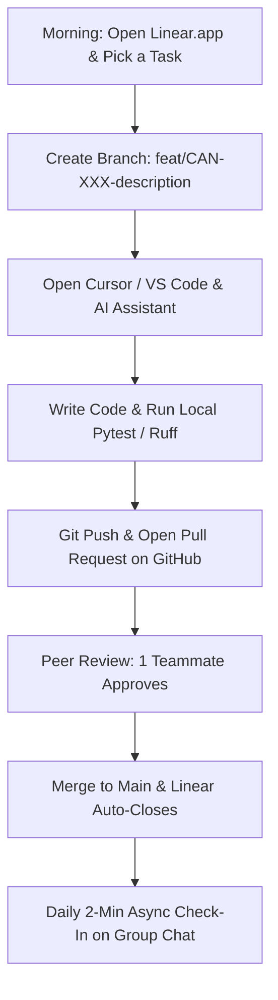

# Canadian Open Data Agentic Platform (CanData-MCP & LangGraph)
## Master Collaboration Plan, Team Roles, Daily Workflow & Launch Roadmap

**Official Repository:** [https://github.com/neobenjax/Canadian-Open-Data-Agentic-Platform.git](https://github.com/neobenjax/Canadian-Open-Data-Agentic-Platform.git)  
**Task Management:** Linear.app Workspace `CanData Platform` (Prefix: `CAN`)

---

## 1. What Are We Actually Building? (The Plain-English Version)

If you ask ChatGPT or Claude right now: *"What was the average rent increase in Brampton compared to inflation last year?"*, it will either give you a confident guess that is completely wrong, or tell you it doesn't have access to real-time Canadian numbers.

Why?
- **AI Models Hallucinate on Canadian Data:** Frontier models weren't properly calibrated on Canadian municipal census tables. They conflate 2-bedroom turnover rents with total averages and invent numbers.
- **Official Canadian Data is Huge:** Statistics Canada tables are massive CSV files (often 100MB to 200MB). You can't just copy-paste that into an AI chat window—it blows the token budget and crashes the system.
- **Different Sources Don't Talk to Each Other:** If you want to compare rent (CMHC/StatCan) with interest rates (Bank of Canada) and immigration (Open Canada), there is no single AI tool that connects them.

**What We Are Building:**
We are building **CanData-MCP**: a high-speed, open-source AI bridge (an MCP server and multi-agent system) that connects Claude, Cursor, and custom AI agents directly to official Canadian REST APIs (StatCan WDS, Bank of Canada, Open Government). 
It slices huge 200MB tables down to tiny 2KB summaries in under 1.5 seconds using **DuckDB**, does exact math using SQL instead of LLM mental math, and guarantees that every single number comes with an official, verifiable source link and table ID.

---

## 2. Why Are We Doing This Together?

### 2.1 Why Building in Public Beats Sending 500 Resumes
In today's Canadian tech market, clicking "Easy Apply" on LinkedIn is like buying a lottery ticket. Every single AI posting gets 300+ applicants within a few hours. Most resumes get deleted by automated screening software without a human ever seeing them.

Hiring managers and tech leads don't hire people who say *"I know AI"*. They hire people who can say:
> *"Here is the link to our open-source repo. Here is how we got a 200MB table down to 2KB in 1.4 seconds. Here is our benchmark showing how we caught Claude hallucinating and fixed it. And here are our code reviews and PRs."*

By building in public and posting our weekly learnings on LinkedIn, we turn the job hunt upside down: **recruiters and engineering leads reach out to us directly**.

### 2.2 Why a 4-Person Team Beats Doing It Alone
- **We Look Like a Real Engineering Team:** A solo portfolio project looks like a weekend hobby. A 4-person team with 50+ years of collective experience across banking technology, data visualization, enterprise delivery, and information security looks and operates like a serious engineering department.
- **We Boost Each Other on LinkedIn:** When one person posts alone, the LinkedIn algorithm barely shows it to anyone. When 4 of us post and jump in within 15–30 minutes to leave insightful, technical comments, the algorithm picks it up and pushes it to thousands of people across the Canadian tech network.
- **Manageable Workload:** We all have busy lives, jobs, or school. Distributing the tasks means nobody burns out, and we ship something real every single week.

---

## 3. The Big Picture: Rotating Team Leadership Across Projects

### 3.1 A True Win-Win Collaboration
This project is **Project #1**, led by **Benjamin** (focusing on Solutions Architecture and the FastMCP/DuckDB core).

Our vision is that this team doesn't stop after just one project. As we build trust and momentum, **other members can step up to lead future collaborative projects**:
- A member can take the lead on a project focused on advanced data visualization and decision analytics.
- A member can lead a project focused on enterprise business process transformation and human-in-the-loop workflows.
- A member can lead a project focused on AI security, automated guardrails, and compliance.

**The Result:** Every single person gets to showcase both **hands-on technical AI contributions** and a **verified Team Lead credential** on their resume and LinkedIn profile.

### 3.2 Everyone Learns the Full Stack (No Silos!)
We are not going to split this project so that one person only touches backend, one person only writes documentation, and another only watches. 

**All four of us want hands-on experience with modern AI and Agentic tools.**
- Everyone will write Python code, configure AI tools, build prompts, write evaluation tests, and open GitHub Pull Requests.
- At the same time, we lean on each other's strengths as mentorship anchors:
  - **Benjamin** anchors Solutions Architecture, Monorepos, and FastMCP.
  - **Samir** anchors Data Truth, Ground-Truth Benchmarks, and Data Visualization.
  - **Person 3** anchors Enterprise Workflow Delivery, Human-in-the-Loop design, and Analytics.
  - **Person 4** anchors AI Security, Guardrails, Data Governance, and Compliance.

---

## 4. The Daily Workflow: Where Do I Start & How Do I Contribute?

Here is the exact, step-by-step know-how so everyone knows what to do starting tomorrow morning.



### 4.1 Step 1: Your Day 1 Morning Setup (15 Minutes)
1. **Clone the repository:**
   ```bash
   git clone https://github.com/neobenjax/Canadian-Open-Data-Agentic-Platform.git
   cd Canadian-Open-Data-Agentic-Platform
   ```
2. **Install `uv` (Fast Python Package Manager):**
   - On Windows (PowerShell):
     ```powershell
     powershell -ExecutionPolicy ByPass -c "irm https://astral.sh/uv/install.ps1 | iex"
     ```
   - On macOS / Linux:
     ```bash
     curl -LsSf https://astral.sh/uv/install.sh | sh
     ```
3. **Set up the virtual environment:**
   ```bash
   uv sync
   ```
4. **Configure your AI Assistant (Claude Code, Cursor, or Antigravity):**
   - Copy the Master System Prompt (found in Section 6 below) into your assistant rules or `.cursorrules`.

---

### 4.2 Step 2: Picking a Task in Linear
1. Log into our Linear workspace: `CanData Platform`.
2. Look at the active cycle (e.g., **Cycle 1 / Sprint 1**).
3. Choose a task card assigned to you (or claim an open one), for example: `CAN-14: Build Bank of Canada Valet Connector`.
4. Move the card to **In Progress** (or it will auto-move once you create your branch).

---

### 4.3 Step 3: Creating Your Git Branch
Always create a clean branch from the latest `main`:
```bash
git checkout main
git pull origin main
git checkout -b feat/CAN-14-boc-connector
```
*(Always use the format `feat/CAN-<IssueNumber>-<short-name>` so Linear and GitHub stay in sync).*

---

### 4.4 Step 4: Writing Code with Your AI Assistant
- Open your editor (VS Code, Cursor, etc.).
- When you prompt your AI assistant, remember that it has been configured with our project persona.
- Work on your module:
  - If you're building a data connector, put it in `/packages/candata-mcp/src/candata_mcp/connectors/`.
  - If you're writing a benchmark test, put it in `/collaboration/benchmarks/`.
  - If you're building UI, put it in `/apps/`.

---

### 4.5 Step 5: Testing Before Pushing
Before sending your code to GitHub, run these two quick sanity checks in your terminal:
```bash
# Run code formatter and linter
uv run ruff check .

# Run tests
uv run pytest
```
If anything fails, ask your AI assistant to fix it!

---

### 4.6 Step 6: Uploading Your Contribution (Push & Open PR)
1. **Commit your changes:**
   ```bash
   git add .
   git commit -m "[CAN-14] feat: add async Bank of Canada Valet API connector"
   ```
2. **Push to GitHub:**
   ```bash
   git push -u origin feat/CAN-14-boc-connector
   ```
3. **Open a Pull Request (PR) on GitHub:**
   - Go to `https://github.com/neobenjax/Canadian-Open-Data-Agentic-Platform/pulls`.
   - Click **New Pull Request**.
   - The PR template will load automatically!
   - Write a short summary of what you did and link the Linear issue (`Closes CAN-14`).
   - Tag one teammate to review it (e.g. `@Benjamin` or `@Samir`).

---

### 4.7 Step 7: Review, Approval & Merging
- Reviewing is simple and friendly: check that the code makes sense, tests pass, and no passwords/secrets are committed.
- Once your teammate clicks **Approve**, the PR can be merged into `main`.
- Linear will automatically mark the issue as **Done**! 🎉

---

### 4.8 Step 8: The 2-Minute Daily Check-In
We don't do long, boring daily meetings. Instead, post a quick 2-minute message in our WhatsApp/Slack group by **10:00 AM EST**:

```markdown
**[Your Name] Daily Sync**
✅ **Done Yesterday:** Completed Bank of Canada connector PR [CAN-14]
➡️ **Today's Focus:** Starting on DuckDB data caching [CAN-15]
🚧 **Blockers:** None / Need quick advice on StatCan API response structure
🤖 **AI Tool Used:** Cursor with Claude 3.5 Sonnet
```

**The "Never Silently Blocked" Rule:**  
If you get stuck for more than 2 hours, or if your day job/life gets crazy busy, **just drop a message in the chat**. Nobody is going to judge you. A teammate will jump on a 15-minute screen share or take over a small task so our team momentum stays strong.

---

## 5. LinkedIn Marketing Strategy: Winning Posts vs. "AI Slop"

We are going to post **once a week (every Tuesday at 8:15 AM EST)**. Here is how we do it so it actually gets recruiters to notice us:

### 5.1 What NOT to Post (Generic AI Slop)
> ❌ *"Excited to announce I'm learning AI! 🚀 Built a cool chatbot with ChatGPT and LangChain that answers questions about Canada! AI is changing the world! Like and follow!"*  
> **Why this fails:** It looks like a high school tutorial. Tech leads and hiring managers scroll right past it.

### 5.2 What TO Post (Authoritative Engineering Receipts)
> ✅ *"We asked Claude 3.5 Sonnet 15 basic questions about Canadian housing and inflation. It hallucinated on 6 of them.*  
> *When asked for Brampton's rent growth, it reported 18.2%. The real StatCan number is 8.4%. The model mixed up 2-bedroom turnover rents with total averages.*  
> *To fix this, our 4-person team built CanData-MCP: DuckDB 1.2+ server-side slicing reduces 200MB tables down to 2.4KB in 1.4s, and a LangGraph verifier enforces exact table citations.*  
> *Hallucinations dropped from 40% to 0% in our automated CI tests.*  
> *Here is our GitHub repo and full scorecard: [link]. Built with @Benjamin @Samir @Person3 @Person4. What Canadian datasets should we index next?"*

### 5.3 The 30-Minute Team Boost
When the weekly post goes live on Tuesday morning:
1. All 3 other members jump on the post within **15 minutes**.
2. Leave a genuine, thoughtful comment (e.g., Person 4 mentions how the security guardrails catch prompt injections; Samir shares a chart from the benchmark).
3. The author replies within **30 minutes**.
4. This signals the LinkedIn algorithm that the post is high-value, pushing it into the feeds of hiring managers and engineering executives across Canada.

---

## 6. The Master AI Assistant System Prompt

Copy this into your AI coding assistant (Cursor, Claude Code, or Antigravity):

```markdown
# CANDATA-MCP PROJECT — TEAM ASSISTANT SYSTEM PROMPT

You are the dedicated Senior AI Engineering Assistant for the "CanData-MCP & LangGraph" team project.
Repository: https://github.com/neobenjax/Canadian-Open-Data-Agentic-Platform.git
Linear Workspace: CanData Platform (CAN)

Your mission is to help your human engineer write clean, production-grade, tested Python 3.12+ code.

## PROJECT STACK
- FastMCP 2.0 (Anthropic MCP SDK)
- LangGraph 0.2+ (TypedState, AsyncSqliteSaver checkpointer)
- DuckDB 1.2+ & Apache Arrow (server-side data slicing)
- Official Canadian REST APIs: StatCan WDS, Bank of Canada Valet, Open Canada CKAN. (NO WEB SCRAPING).
- Testing: pytest, Ruff, Pyright, DeepEval.

## FIRST MESSAGE PROTOCOL
If you do not know the user's role yet, ask:
"Welcome to the CanData team workspace! Which team member are you today?
1: Benjamin (Solutions Architect & MCP Core)
2: Samir (Data Visualization & Agent Evals Lead)
3: Person 3 (Tech Delivery & Transformation Lead)
4: Person 4 (AI Security & Risk Governance Lead)"

Once selected:
- Provide friendly, clear, high-quality code.
- Always include pytest unit tests for new code.
- Format git commit suggestions with Linear keys: [CAN-XXX] feat: description.
```

---

## 7. Next Steps After the Kickoff Call

1. **Clone the Repo:** Run `git clone` and `uv sync`.
2. **Setup Assistant:** Paste the system prompt into your AI tool.
3. **Claim Your Issue:** Open Linear and assign yourself your Sprint 1 task.
4. **Daily Check-In:** Drop your first update in the group chat tomorrow morning!
