# Contributing & Branch Protection Guide

Welcome to the **Canadian Open Data Agentic Platform**! To guarantee production-grade code quality, security, and seamless collaboration across our 4-person team, this repository enforces strict branch protection and GitHub rulesets.

---

## 1. Active Branch Protection Rule (Enforced on `main`)

Our GitHub repository enforces the following rule on branch `main`:

> 🔒 **Direct pushes to `main` are strictly blocked.**  
> All code contributions MUST be submitted through a Pull Request and approved by at least **1 peer reviewer** before merging.

### Summary of Active Protections:
- **Require a pull request before merging:** Enabled.
- **Require approvals:** **1 approval minimum**. Pull requests targeting `main` cannot be merged until another team member has reviewed and approved the changes.
- **No unreviewed code:** Merging is disabled until review requirements are satisfied.

---

## 2. Standard Feature Branch Workflow

Every team member and AI coding assistant MUST follow this workflow:

```mermaid
flowchart LR
    A[Linear Task: CAN-XXX] --> B[git checkout main && git pull origin main]
    B --> C[git checkout -b feat/CAN-XXX-description]
    C --> D[Write Code & Run uv run pytest]
    D --> E[git push -u origin feat/CAN-XXX-description]
    E --> F[Open PR with template]
    F --> G[1 Teammate Reviews & Approves]
    G --> H[Merge to main]
    H --> I[Delete local & remote feature branch]
```



### Step-by-Step Instructions:
1. **Always start from the latest `main`:**
   ```bash
   git checkout main
   git pull origin main
   ```
2. **Create your feature branch:**
   Format: `feat/<issue-id>-<short-description>` or `fix/<issue-id>-<short-description>`  
   *(Note: The issue ID comes from your Linear task, e.g. `CAN-01`)*:
   ```bash
   git checkout -b feat/CAN-01-update-team-profile
   ```
3. **Commit your changes using Conventional Commits:**
   ```bash
   git add .
   git commit -m "[CAN-01] feat: update profile card and add bio"
   ```
4. **Push your branch to GitHub:**
   ```bash
   git push -u origin feat/CAN-01-update-team-profile
   ```
5. **Open a Pull Request:**
   - Go to GitHub and open a PR targeting `main`.
   - The `.github/PULL_REQUEST_TEMPLATE.md` will populate automatically.
   - Tag one teammate to review (e.g. `@samiroibrahim`, `@benjaminsanchezzebadua`, etc.).
6. **Address feedback & Merge:**
   - Once your teammate approves the PR, merge it into `main`.
7. **Purge the merged branch:**
   ```bash
   git checkout main
   git pull origin main
   git branch -d feat/CAN-01-update-team-profile
   git push origin --delete feat/CAN-01-update-team-profile
   ```

---

## 3. Recommended GitHub Rulesets to Deepen Security & Quality

To elevate this repository to enterprise engineering standards, we recommend enabling the following settings under **GitHub Repository Settings $\rightarrow$ Rules $\rightarrow$ Rulesets** (or Branch Protection):

| Recommended Rule | Why It Protects Our Team |
|---|---|
| **Dismiss stale approvals when new commits are pushed** | If an approver gives a green light and the author pushes 5 new commits, the approval is revoked until re-reviewed. Prevents accidental bugs from sneaking in after approval. |
| **Require status checks to pass before merging** | Blocks PR merges if automated CI workflows (`ruff check`, `pytest`, `pyright`) fail. Guarantees broken code never enters `main`. |
| **Require conversation resolution before merging** | Ensures all review comments and questions raised by teammates must be marked "Resolved" before the merge button unlocks. |
| **Block force pushes (`--force`)** | Disables `git push --force` on `main` to prevent anyone from accidentally overwriting repository history. |
| **Block branch deletion** | Prevents anyone from accidentally deleting `main`. |
| **GitHub Secret Scanning & Push Protection** | Automatically detects and blocks commits containing API keys, private tokens, or passwords before they reach GitHub. (Settings $\rightarrow$ Code security and analysis $\rightarrow$ Secret scanning). |
| **Require signed commits (Optional)** | Ensures commits are verified with GPG/SSH keys for tamper-proof commit histories. |

---

## 4. Local Developer Pre-Flight Checklist

Before opening any PR, ensure your local environment passes these sanity checks:
```bash
# 1. Check code formatting & linting
uv run ruff check .

# 2. Run unit tests
uv run pytest

# 3. Verify type annotations
uv run pyright
```
