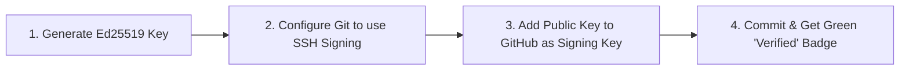
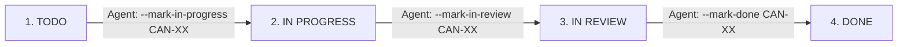

# Developer Account Setup & Agent Automation Guide

This guide provides step-by-step instructions for team members (**Benjamin, Samir, Yassir**) to configure their accounts for secure, verified collaboration and demonstrates how our AI assistants (**Cursor, Claude Code, Antigravity, Copilot**) automate task tracking, commit signing, and Linear issue synchronization.

---

## 🔐 Part 1: GitHub SSH Key & Verified Commit Signing

To comply with enterprise security standards and branch protection, all commits should be cryptographically signed using SSH keys, yielding the green **Verified** badge on GitHub.



### Step 1.1: Generate Your SSH Key (If Not Already Created)
Open your terminal (PowerShell or Bash) and run:
```bash
ssh-keygen -t ed25519 -C "your_email@example.com"
```
*(Press Enter to save to default location `~/.ssh/id_ed25519`)*.

### Step 1.2: Configure Git for Automatic SSH Signing
Tell Git to use SSH format for signing all commits:
```bash
# 1. Set SSH as the signing format
git config --global gpg.format ssh

# 2. Point to your public SSH key
# On Windows PowerShell:
git config --global user.signingkey "$HOME/.ssh/id_ed25519.pub"

# On macOS / Linux:
git config --global user.signingkey ~/.ssh/id_ed25519.pub

# 3. Enable automatic commit signing globally
git config --global commit.gpgsign true

# 4. Verify your git user identity matches your GitHub account
git config --global user.name "Your Name"
git config --global user.email "your_email@example.com"
```

### Step 1.3: Add Your Signing Key to GitHub
1. Copy your public key:
   - **Windows:** `Get-Content ~/.ssh/id_ed25519.pub | Set-Clipboard`
   - **macOS:** `pbcopy < ~/.ssh/id_ed25519.pub`
   - **Linux:** `cat ~/.ssh/id_ed25519.pub`
2. Go to GitHub: [https://github.com/settings/keys](https://github.com/settings/keys).
3. Click **New SSH Key**.
4. In the **Key type** dropdown, select **Signing Key** (IMPORTANT: Select *Signing Key*, not Authentication Key).
5. Paste your key and click **Add SSH Key**.

### Step 1.4: Verify Your Commit Signing
Run a test commit on your feature branch:
```bash
git commit -m "[CAN-00] test: verify commit signing"
git log --show-signature -1
```
When pushed to GitHub, your commit will show a green **Verified** badge.

---

## 📋 Part 2: Linear.app Workspace & Personal API Key

Our team tracks cycles and epics in Linear:
- **Workspace:** [https://linear.app/canopendataagenticplatform/team/CAN/active](https://linear.app/canopendataagenticplatform/team/CAN/active)
- **Team Key:** `CAN` (Issues format: `CAN-01`, `CAN-02`, etc.)
- **Free Tier Confirmation:** Linear Personal API Keys (`lin_api_...`) are **100% free** and provide full read/write access to list, create, and transition tasks.

### Step 2.1: Generate Your Personal API Key
1. Go to Linear: [linear.app/canopendataagenticplatform](https://linear.app/canopendataagenticplatform).
2. Click your avatar (bottom left) $\rightarrow$ **Settings** $\rightarrow$ **Account** $\rightarrow$ **Security & Access**.
3. Under **Personal API keys**, click **Create Key**.
4. Name it `Agent-Key` and copy the secret token (`lin_api_...`).
5. Add it to your local environment (e.g. in your `.env` or shell profile):
   ```bash
   # Windows PowerShell
   [System.Environment]::SetEnvironmentVariable('LINEAR_API_KEY', 'lin_api_YOUR_TOKEN', 'User')

   # macOS / Linux (bash/zsh)
   export LINEAR_API_KEY="lin_api_YOUR_TOKEN"
   ```

---

## 🤖 Part 3: Connecting Your AI Agent to Linear (MCP Integration)

By configuring the official **Linear Model Context Protocol (MCP)** server, your AI assistant (**Cursor, Claude Desktop, Antigravity**) can query, create, and modify tasks directly.

### Configuration for Cursor:
1. Open Cursor $\rightarrow$ **Cursor Settings** $\rightarrow$ **Features** $\rightarrow$ **MCP**.
2. Click **+ Add New MCP Server**.
3. Fill in:
   - **Name:** `linear`
   - **Type:** `command`
   - **Command:** `npx -y @modelcontextprotocol/server-linear`
4. Set Environment Variable:
   ```json
   {
     "LINEAR_API_KEY": "lin_api_YOUR_TOKEN_HERE"
   }
   ```

### Configuration for Claude Desktop:
In `~/Library/Application Support/Claude/claude_desktop_config.json` (Mac) or `%APPDATA%\Claude\claude_desktop_config.json` (Windows):
```json
{
  "mcpServers": {
    "linear": {
      "command": "npx",
      "args": ["-y", "@modelcontextprotocol/server-linear"],
      "env": {
        "LINEAR_API_KEY": "lin_api_YOUR_TOKEN_HERE"
      }
    }
  }
}
```

---

## 🔄 Part 4: Loading All Milestones & Tasks into Linear.app

We provide an automated CLI utility at `scripts/sync_tasks.py` that can load all 36 tasks and 7 milestones directly into Linear:

### Option 4.1: Direct Guided Upload via GraphQL API
Run:
```bash
python scripts/sync_tasks.py --upload-to-linear
```
- If `LINEAR_API_KEY` is not already in your environment, the script prompts you to paste it.
- It connects to Linear, verifies the team, creates Projects for each Milestone, matches team members (Benjamin, Samir, Yassir), and creates all tasks idempotently (skips already existing tasks).

### Option 4.2: 1-Click CSV Web Import
If you prefer using Linear's web interface:
```bash
python scripts/sync_tasks.py --export-csv linear_tasks_import.csv
```
Then navigate to: **Linear $\rightarrow$ Settings $\rightarrow$ Import / Export $\rightarrow$ Import CSV** and upload `linear_tasks_import.csv`!

---

## ⚡ Part 5: The Automated Lifecycle (TASKS.md + Linear Mirror)

Every task follows a 4-stage lifecycle synchronized between `TASKS.md` and Linear.app:



### 1. Starting a Task (TODO $\rightarrow$ IN PROGRESS):
When a developer says: *"I'm going to work on CAN-02"*:
```bash
python scripts/sync_tasks.py --mark-in-progress CAN-02 --assignee Samir
```
- **In Linear:** Task moves to **In Progress** and is assigned to Samir.
- **In TASKS.md:** Updated to `- [ ] **CAN-02 (Samir's Onboarding Chore):** [IN PROGRESS] ...`

### 2. Ready for Pull Request (IN PROGRESS $\rightarrow$ IN REVIEW):
When the code is written, verified, and the PR branch is pushed:
```bash
python scripts/sync_tasks.py --mark-in-review CAN-02
```
- **In Linear:** Task moves to **In Review**.
- **In TASKS.md:** Updated to `- [ ] **CAN-02 (Samir's Onboarding Chore):** [IN REVIEW] ...`

### 3. PR Merged (IN REVIEW $\rightarrow$ DONE):
When the PR is approved and merged into `main`:
```bash
python scripts/sync_tasks.py --mark-done CAN-02
```
- **In Linear:** Task moves to **Done**.
- **In TASKS.md:** Checkbox flips to `- [x] **CAN-02 (Samir's Onboarding Chore):** ...`

---

## 💬 Part 6: How Team Members Manage Status Changes

### Method A: Asking Your AI Agent (Zero-Friction)
Team members can simply instruct their agent:
- *"I am starting work on CAN-02"* $\rightarrow$ Agent runs `sync_tasks.py --mark-in-progress CAN-02`.
- *"I'm pushing the PR for CAN-02"* $\rightarrow$ Agent runs `sync_tasks.py --mark-in-review CAN-02`.
- *"PR has been merged for CAN-02"* $\rightarrow$ Agent runs `sync_tasks.py --mark-done CAN-02`.


### Method B: Manual Linear UI Changes (Visual Board)
1. Open the board: [https://linear.app/canopendataagenticplatform/team/CAN/active](https://linear.app/canopendataagenticplatform/team/CAN/active).
2. Drag your task card between columns:
   - **Todo** $\rightarrow$ Initial backlog state.
   - **In Progress** $\rightarrow$ When you create your branch (`feat/CAN-XXX-...`).
   - **In Review** $\rightarrow$ When you open your GitHub PR and assign your triangular reviewer.
   - **Done** $\rightarrow$ When your PR merges into `main` (Linear also does this automatically if your PR body says `Closes CAN-XXX`!).

---

## 🚀 Part 6: Agent Self-Setup Commands

Team members can ask their agent to assist with any of the steps above:
- *"Check my git SSH signing configuration"* $\rightarrow$ Agent runs `git config --get commit.gpgsign`.
- *"Show me my pending tasks from TASKS.md"* $\rightarrow$ Agent runs `python scripts/sync_tasks.py --owner <Name>`.
- *"Verify if our tasks match Linear"* $\rightarrow$ Agent runs `python scripts/sync_tasks.py --status --sync-linear`.
