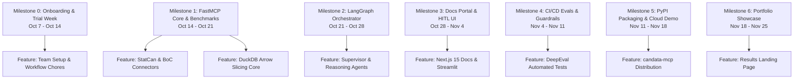

# Linear.app & Multi-Agent Collaboration Guide

This guide explains how our team manages tasks, milestones, and cycles using **Linear.app**, and how each team member can connect their AI coding assistant (**Cursor, Claude Code, Antigravity, Codex**) directly to Linear to manage issues autonomously.

---

## 1. Linear Workspace Details

- **Workspace URL:** [https://linear.app/canopendataagenticplatform/team/CAN/active](https://linear.app/canopendataagenticplatform/team/CAN/active)
- **Team Key:** `CAN` (All issues follow the format `CAN-1`, `CAN-2`, etc.)
- **Team Join Link:** [Click here to join the team](https://linear.app/canopendataagenticplatform/join/086e02cf75e8b0f113d0214368e4342a?s=0)

---

## 2. Linear Free Tier Confirmation & Capabilities

> [!NOTE]
> **Free Tier Confirmed:** Linear's API and Personal API Keys are **100% available and free**. You do NOT need a paid Linear plan to connect AI Agents or the Linear MCP server.

### What the Free Plan Includes:
- Unlimited Personal API Keys (`lin_api_...`).
- Full access to the GraphQL / REST API for listing, creating, and updating issues.
- Bi-directional GitHub integration (branch auto-linking, PR closing via `Closes CAN-XXX`).
- Up to 250 active issues and unlimited completed issues.

---

## 3. How to Connect Your AI Agent to Linear (MCP Server)

By connecting your AI assistant to the official **Linear Model Context Protocol (MCP) Server** (`@modelcontextprotocol/server-linear`), your agent can:
- Look up your assigned tasks directly: *"What are my active tasks for Sprint 0?"*
- Move issues from *Todo* $\rightarrow$ *In Progress* $\rightarrow$ *In Review*.
- Read issue descriptions, acceptance criteria, and add progress comments.

### Step 3.1: Generate Your Linear Personal API Key
1. Go to Linear: [linear.app/canopendataagenticplatform](https://linear.app/canopendataagenticplatform).
2. Click your avatar (bottom left) $\rightarrow$ **Settings** $\rightarrow$ **Account** $\rightarrow$ **Security & Access**.
3. Under **Personal API keys**, click **Create Key**.
4. Name it `Agent-Key` and copy the generated token (`lin_api_...`).

---

### Step 3.2: Configure Your Specific AI Agent

#### A. Cursor
Add the Linear MCP server in Cursor settings:
1. Go to **Cursor Settings** $\rightarrow$ **Features** $\rightarrow$ **MCP**.
2. Click **+ Add New MCP Server**.
3. Configure:
   - **Name:** `linear`
   - **Type:** `command`
   - **Command:** `npx -y @modelcontextprotocol/server-linear`
4. Set the environment variable:
   ```json
   {
     "LINEAR_API_KEY": "lin_api_YOUR_TOKEN_HERE"
   }
   ```

#### B. Claude Desktop
Add to your `claude_desktop_config.json`:
```json
{
  "mcpServers": {
    "linear": {
      "command": "npx",
      "args": ["-y", "@modelcontextprotocol/server-linear"],
      "env": {
        "LINEAR_API_KEY": "lin_api_YOUR_TOKEN_HERE"
      }
    }
  }
}
```

#### C. Antigravity / Gemini CLI
Add to `mcp_servers` configuration in your settings or workspace config:
```json
{
  "name": "linear",
  "command": "npx",
  "args": ["-y", "@modelcontextprotocol/server-linear"],
  "env": {
    "LINEAR_API_KEY": "lin_api_YOUR_TOKEN_HERE"
  }
}
```

#### D. Claude Code (Terminal CLI)
Run:
```bash
claude mcp add linear npx -y @modelcontextprotocol/server-linear --env LINEAR_API_KEY=lin_api_YOUR_TOKEN_HERE
```

---

## 4. Jira-like Milestone & Feature Hierarchy in Linear

To demonstrate sound software engineering governance, our project is structured into **Milestones, Features, and Tasks**:



### How to Load Tasks & Milestones into Linear

You can easily populate these tasks into Linear via two simple methods:

#### Method 1: Using Linear CSV Import
1. In Linear, go to **Settings** $\rightarrow$ **Import / Export** $\rightarrow$ **Import from CSV**.
2. Use this format:
```csv
Title,Description,Status,Priority,Estimate
"[CAN-01] Benjamin: Update Team Profile Card & Links","Claim task, update ABOUT_THE_TEAM.md, push to branch feat/CAN-01-profile-update, and open PR",Todo,High,2
"[CAN-02] Samir: Update Team Profile & Draft 3 Housing Benchmarks","Claim task, update ABOUT_THE_TEAM.md, add benchmark draft in collaboration/benchmarks, open PR",Todo,High,2
"[CAN-03] Yassir: Update Team Profile & Add Sprint 0 Meeting Notes","Claim task, update ABOUT_THE_TEAM.md, create sprint 0 notes template, open PR",Todo,High,2
"[CAN-04] Martin: Update Team Profile & Draft Security Checklist","Claim task, update ABOUT_THE_TEAM.md, add initial risk checklist in collaboration/governance, open PR",Todo,High,2
```

#### Method 2: Asking Your AI Agent
Once your Linear MCP server is active, you can simply tell your agent:
> *"Load all tasks from TASKS.md under Milestone 0 into Linear Team CAN with estimates and assignees."*  
Your agent will call the Linear API tool to create each issue automatically!

---

## 5. Recommended Core Skills for All Team Members

Every team member should install these three recommended skill repositories into their AI agents:

1. **Frontend Slides Skill:**  
   🔗 [https://github.com/zarazhangrui/frontend-slides](https://github.com/zarazhangrui/frontend-slides)  
   *Purpose:* Create zero-dependency, fixed 16:9 interactive HTML presentations for weekly team demos.
2. **Modern Web Guidance Skill (Google Chrome Team):**  
   🔗 [https://github.com/googlechrome/modern-web-guidance](https://github.com/googlechrome/modern-web-guidance)  
   *Purpose:* Google Chrome official best practices for responsive, accessible, zero-slop UI development.
3. **Python Best Practices Skill (Ludo Technologies):**  
   🔗 [https://github.com/ludo-technologies/python-best-practices](https://github.com/ludo-technologies/python-best-practices)  
   *Purpose:* Industry-standard Python 3.12+ patterns with `uv`, strict type annotations, Ruff formatting, and pytest.
